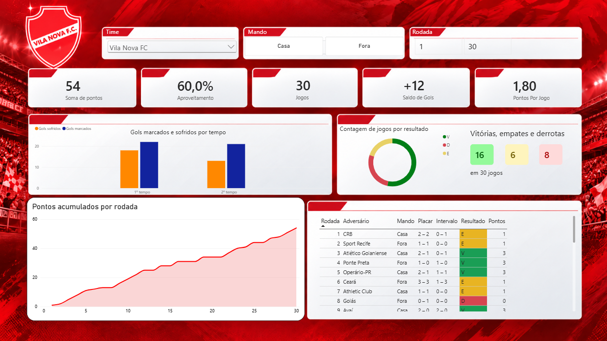
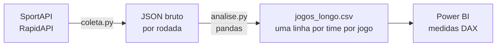

# Vila Nova na Série B 2026 ⚽

Dashboard da campanha do Vila Nova no Campeonato Brasileiro Série B 2026, com comparação com os rivais goianos Atlético-GO e Goiás. O projeto cobre o fluxo completo de dados: coleta via API REST, tratamento e validação com pandas, e visualização no Power BI.

> Dados até a 30ª rodada (jogos disputados entre 21/03 e 25/09/2026).



## Principais insights

- **O Vila lidera a Série B com 54 pontos e 60% de aproveitamento**, 2 pontos à frente do 2º colocado.
- **A campanha tem duas caras.** Em casa, o aproveitamento é de **84,4%** (12 vitórias, 2 empates e 1 derrota). Fora, cai para **35,6%**. São 48,9 pontos percentuais de diferença, e **70,4% dos pontos** vieram como mandante.
- **O saldo de gols confirma o padrão:** +20 em casa (31 a 11) e -8 fora (12 a 20).
- **O Atlético-GO é o rival mais regular**, com 62,2% em casa e 46,7% fora (15,6 p.p. de diferença), enquanto o Goiás repete o perfil do Vila em escala menor.
- **Não há um "time de segundo tempo":** os gols do Vila se dividem quase igualmente (22 no 1º tempo, 21 no 2º), e o mesmo vale para os rivais.

## Fluxo de dados



1. **Coleta (`coleta.py`):** baixa os jogos das 38 rodadas pela SportAPI (RapidAPI). Rodadas já encerradas ficam em cache, então as atualizações só gastam requisições nas rodadas com jogos pendentes.
2. **Tratamento (`analise.py`):** filtra os jogos encerrados, valida os dados e transforma a tabela para o formato longo.
3. **Visualização (`vila-nova-serie-b-2026.pbix`):** relatório no Power BI com segmentações de time, mando e rodada, cartões de KPIs, evolução dos pontos, resultados, gols por tempo e tabela de jogos.

## Tratamento e validação dos dados

Alguns cuidados tomados no notebook:

- **Jogos adiados:** a API retornou 383 jogos para uma temporada de 380. Os 3 extras eram registros antigos de partidas remarcadas (status `postponed`), cada um com uma cópia `finished` na mesma rodada. Eles foram descartados.
- **Gols por tempo:** conferi em todos os 298 jogos encerrados que gols do 1º tempo + 2º tempo = placar final, sem nenhum valor vazio.
- **Conferência com a tabela oficial:** os pontos calculados reproduzem a classificação real (Vila Nova 54, Atlético-GO 49, Goiás 42).

### Por que formato longo?

A API entrega uma linha por partida, com mandante e visitante lado a lado. Transformei cada partida em duas linhas, uma do ponto de vista de cada time:

| time | adversario | mando | gols_pro | gols_contra | resultado | pontos |
|---|---|---|---|---|---|---|
| Vila Nova FC | CRB | Casa | 2 | 2 | E | 1 |
| CRB | Vila Nova FC | Fora | 2 | 2 | E | 1 |

Assim existe uma única coluna `time`, e qualquer métrica (pontos, aproveitamento, gols) é calculada do mesmo jeito para qualquer clube. No Power BI, comparar o Vila com os rivais vira apenas um filtro.

## Métricas (DAX)

```dax
Pontos = SUM(jogos_longo[pontos])
Jogos = COUNTROWS(jogos_longo)
Aproveitamento = DIVIDE([Pontos], [Jogos] * 3)
Pontos por jogo = DIVIDE([Pontos], [Jogos])
```

As métricas são sempre calculadas a partir das somas de pontos e jogos, e não pela média de porcentagens, para continuarem corretas em qualquer recorte (mando, intervalo de rodadas ou resultado).

## Estrutura do repositório

```
├── coleta.py                   # coleta dos dados na API
├── analise.py               # tratamento, validação e exportação
├── data/processed/
│   └── jogos_longo.csv         # base usada no Power BI
├── vila-nova-serie-b-2026.pbix # relatório
├── images/                     # capturas do dashboard
├── requirements.txt
└── .env.example
```

## Como executar

```bash
git clone https://github.com/vitorrrfernandes/vila-nova-serie-b-2026.git
cd vila-nova-serie-b-2026
pip install -r requirements.txt
cp .env.example .env   # coloque sua chave da RapidAPI no arquivo .env
python coleta.py
```

Depois, rode as células do `analise.py` para gerar o `data/processed/jogos_longo.csv` e atualize o relatório no Power BI Desktop.

## Tecnologias

Python (requests, pandas), Jupyter, Power BI (Power Query e DAX) e SportAPI via RapidAPI.

## Próximos passos

- Incluir os próximos adversários do Vila nas rodadas 31 a 38.
- Automatizar a coleta com GitHub Actions para atualizar a base após cada rodada.
- Adicionar estatísticas por minuto dos gols e por jogador.

---

Feito por [Vitor Fernandes](https://github.com/vitorrrfernandes), estudante de Sistemas de Informação na UFG.
